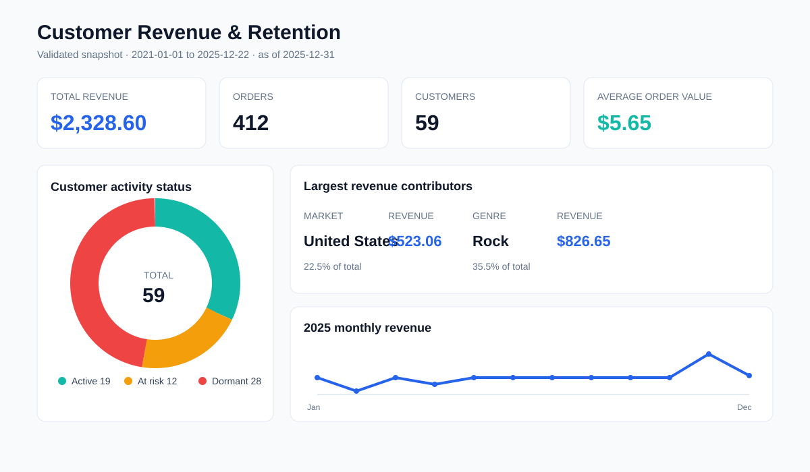
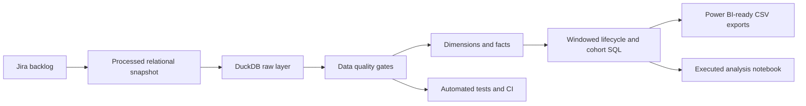

# Customer Revenue & Retention Analytics

[](https://github.com/ermanesen/jira-analytics-project/actions/workflows/ci.yml)
[](LICENSE)

An end-to-end analytics case study that turns Jira-style requirements into a tested relational model, decision-ready customer metrics and Power BI-ready datasets.



## Executive summary

The pipeline reconciles **2,240 line items** to **412 invoices** from **59 customers**, covering **2021-01-01 to 2025-12-22**. Total revenue is **$2,328.60** and average order value is **$5.65**.

- The United States contributes **$523.06 (22.5%)**, the largest country total.
- Rock contributes **$826.65 (35.5%)**, the largest genre total.
- At the fixed analysis date of **2025-12-31**, **19 customers are Active**, **12 At risk**, and **28 Dormant**, using transparent 90/180-day inactivity thresholds.
- All 2025 buyers are repeat buyers. Because Chinook sales are generated sample data, this pattern demonstrates the metric implementation; it is not a real-world retention benchmark.

The recommended action is to prioritise re-engagement experiments for the 12 At-risk customers, treat the 28 Dormant customers separately, and protect high-performing US and Rock revenue. Customer-level exports use IDs rather than direct identifiers.

## Why this is not a churn project

The previous repository used a 500-row tutorial dataset with no churn flag, transaction dates or last-activity field. Churn could not be measured. This rebuild removes that unsupported claim. It reports **inactivity risk**, an operational proxy, and never presents it as observed contractual churn.

## Business question and metric definitions

**Decision:** Which customers, markets and product categories drive revenue, and which customer relationships show measurable inactivity risk?

| Metric | Definition |
|---|---|
| Revenue | Sum of invoice-line price × quantity; reconciled to invoice totals |
| Active customers | Distinct customers with an invoice in the period |
| Average order value | Revenue ÷ distinct invoices |
| Repeat buyer rate | Active customers whose first invoice month precedes the current month ÷ active customers |
| Cohort continuation | Cohort customers purchasing in month *n* after first purchase ÷ cohort size |
| Activity status | Active ≤90 days; At risk 91–180; Dormant >180 days since last invoice, as of 2025-12-31 |

Inactivity thresholds are analytical assumptions, not labels supplied by the source.

## Architecture



The SQL is deliberately layered and numbered. It includes joins, CTEs, window functions, a date spine, rolling revenue, cohort continuation, RFM scoring and invoice-to-line reconciliation.

## Reproduce the analysis

```bash
python -m venv .venv
python -m pip install -r requirements.txt
$env:PYTHONPATH="src"
python scripts/run_pipeline.py --database analytics.duckdb --verbose
jupyter nbconvert --to notebook --execute notebooks/customer_lifecycle_analysis.ipynb --inplace
pytest
```

On macOS/Linux, use `export PYTHONPATH=src`. The database file is a local build artifact and is ignored by Git.

## Power BI handoff

The pipeline writes six validated CSVs to `powerbi/exports/`. Import them into Power BI Desktop and follow [the model guide](powerbi/README.md); reusable measures are in [measures.dax](powerbi/measures.dax).

No `.pbix` or `.pbip` is claimed here: Power BI Desktop was not available in the build environment, so an unvalidated binary/project file would be misleading. The SVG above is an honest preview generated from the same validated snapshot.

## Repository structure

```text
data/processed/       Privacy-minimised relational snapshot
docs/                 Dashboard preview and data dictionary
notebooks/            Executed, reader-facing analysis
powerbi/              Import guide, DAX measures, theme and exports
project/              Jira-style epic and acceptance criteria
reports/              Final analytical and validation report
scripts/              Pipeline entry point
sql/                  Numbered DuckDB transformation layers
src/jira_analytics/   Reusable pipeline code
tests/                 Data, SQL, notebook and repository checks
```

## Data provenance and limitations

The source is the MIT-licensed [Chinook sample database](https://github.com/lerocha/chinook-database). It is useful for demonstrating relational analytics: customers and sales are fictional/auto-generated, while catalog metadata is derived from a media library. This project is therefore a workflow and SQL portfolio case study, not market evidence. Direct customer identifiers are not committed. See [the source manifest](data/source_manifest.json) and [third-party notice](THIRD_PARTY_NOTICES.md).

## License

Code and original documentation are released under the [MIT License](LICENSE). The source data retains its upstream license and attribution.

